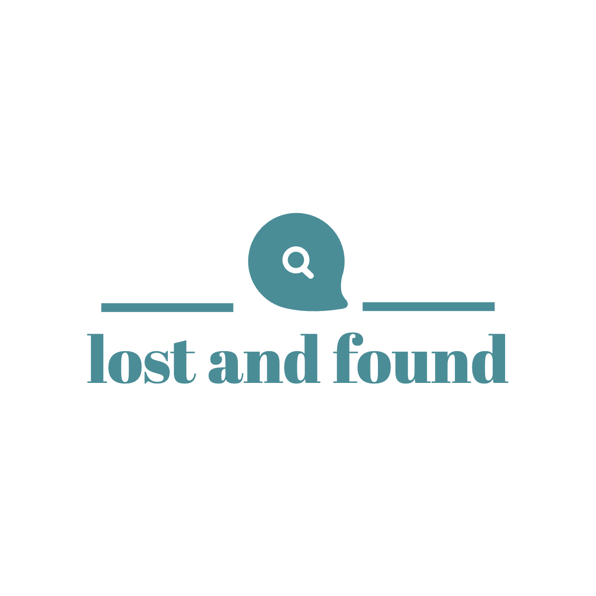

<h1 align="center" width="100%" style="text-align: center;">
    <a href="http://172.17.0.80:3000/"></a>
</h1>

<h1 align="center" width="100%" style="text-align: center; color:green;">
  <a href="http://172.17.0.80:3000/"> Lost And Found </a>
</h1>

<h3 align="center" width="100%" style="text-align: center;">We help you find your lost items!</h3>


<p align="center" width="100%" style="text-align: center;">
 <a href="#about">About</a> •
 <a href="#features">Features</a> •
 <a href="#how-it-works">How it works</a> • 
 <a href="#tech-stack">Tech Stack</a> •  
 <a href="#user-scenarios">User Scenarios</a> •  
 <a href="#contributors">Contributors</a> •
 <a href="#test-coverage">Test Coverage</a>
 </p>

## About

Lost and found website is designed to help users find lost items by allowing them to report lost items, search for found items, and connect with others in their community.

---

## Features

- [x] Users can post any item they found
- [x] Users can search in item lost catalogue and request the user for return.
- [x] Connect and chat with the item founder and approved user
- [x] Return the found item and earn rewards


---

## How it works

The project is divided into two parts:

1. Backend 
2. Frontend 


### Pre-requisites

Before you begin, you will need to have the following tools installed on your machine:

- [Git](https://git-scm.com)
- [Node.js](https://nodejs.org/en/) v14.21.3
- [Java](https://www.oracle.com/java/technologies/downloads/) v17
- [Docker](https://www.docker.com/products/docker-desktop/)

### Preferred IDE
- Frontend - [VS Code](https://code.visualstudio.com/download)
- Backend - [Intellj IDEA](https://www.jetbrains.com/edu-products/download/other-IIE.html)


#### Cloning project

```bash

# Clone this repository
$ git clone https://git.cs.dal.ca/courses/2023-fall/csci-5308/Group07

```

#### Running the web application (Frontend)

```bash

# Access the project folder in your terminal
$ cd frontend/lost-and-found

# Install the dependencies
$ npm install

# Run the application in development mode
$ npm run start

# The application will open on the port: 3000 - go to http://localhost:3000
```

#### Build and deploy web application using docker

```bash
# Create docker image of frontend application
$ docker build -t <your_dockerhub_username>/lost-and-found:latest-fe -f ./frontend/LostAndFound/Dockerfile ./frontend/LostAndFound    

# Push the docker image to Docker hub.
$ docker push lost-and-found:latest-fe

# Pull the docker image from Docker hub to your server.
$ docker pull docker.io/<your_dockerhub_username>/lost-and-found:latest-fe

# Run the docker command to start the frontend application on your server.
$ docker run -d -p 3000:3000 --name lost-and-found-frontend docker.io/<your_dockerhub_username>/lost-and-found:latest-fe

```

#### Running the springboot application (Backend)

```bash    

# Access the project folder in your terminal
$ cd Backend/LostAndFound  

# Build the project    
$ mvn clean install     
    
# Run the Spring Boot application 
$ mvn spring-boot:run    
```

#### Build and deploy springboot application using docker

```bash
# Create docker image of backend application
$ docker build -t <your_dockerhub_username>/lost-and-found:latest-be -f ./Backend/LostAndFound/Dockerfile ./Backend/LostAndFound    

# Push the docker image to Docker hub.
$ docker push lost-and-found:latest-be

# Pull the docker image from Docker hub to your server.
$ docker pull docker.io/<your_dockerhub_username>/lost-and-found:latest-be

# Run the docker command to start the backend application on your server.
$ docker run -d -p 8080:8080 --name lost-and-found-backend docker.io/<your_dockerhub_username>/lost-and-found:latest-be

  ```


---


## Tech Stack

The following tools were used in the construction of the project:

 **React**
- A JavaScript library for building user interfaces.

 **Spring Boot**
- A Java-based framework for building web applications and microservices.

 **MongoDB**
- A NoSQL database for storing and retrieving data.


#### Dependencies

##### Frontend

- **@emotion/react**: ^11.11.1
- **@emotion/styled**: ^11.11.0
- **@mui/icons-material**: ^5.14.18
- **@mui/material**: ^5.14.18
- **@testing-library/jest-dom**: ^5.17.0
- **@testing-library/react**: ^13.4.0
- **@testing-library/user-event**: ^13.5.0
- **axios**: ^1.5.1
- **bootstrap-icons**: ^1.11.1
- **cross-env**: ^7.0.3
- **dotenv**: ^16.3.1
- **firebase**: ^10.5.0
- **leaflet**: 1.7.1
- **leaflet-geosearch**: 3.2.1
- **leaflet-search**: ^4.0.0
- **lodash**: ^4.17.21
- **react**: ^17.0.2
- **react-bootstrap**: ^2.9.0
- **react-bootstrap-icons**: ^1.10.3
- **react-bootstrap-toggle**: ^2.3.2
- **react-dom**: ^17.0.2
- **react-footer-comp**: ^3.0.1
- **react-icons**: ^4.11.0
- **react-leaflet**: 3.1.0
- **react-redux**: ^8.1.3
- **react-router-dom**: ^5.3.4
- **react-scripts**: 5.0.1
- **react-scroll**: ^1.9.0
- **react-toastify**: ^9.1.3
- **redux**: ^4.2.1
- **redux-thunk**: ^2.4.2
- **uuid**: ^9.0.1
- **validator**: ^13.11.0
- **web-vitals**: ^2.1.4

##### Backend

- **Spring Boot Starter Parent Version**: 2.7.16
- **Java Version**: 17
- **Auth0 Spring Security API Version**: 1.5.2
- **JUnit Jupiter API Version**: 5.10.1
- **Spring Boot Starter Data MongoDB Version**: 3.1.4
- **Lombok Version**: 1.18.30

---

## User Scenarios

1. **Sign-up Screen**
  
  <span>
  <span>
2. **Login Screen**
  
  <span>
  <span>

3. **Verify Email before login**
   
  <span>
  <span>

4. **Reset password**
   
   
   
   <span>
   <span>
5. **Home Screen**
   <span>
   1. **Found items posted by user**
    

   2. **Apply filters (Below image shows filter applied using keyword)**
   
   <span>
   <span>
6. **Report Lost Item**
   <span>
  User can report lost items by entering following details:
   - Name of item
   - Item Description
   - Category
   - Upload images/videos related to item
   - Last seen location of item
  Users can edit the details of posted lost items
   
   <span>
   <span>
1. **Report Found Item**
   <span>
   User can report found items by entering following details:
   - Name of item
   - Item Description
   - Category
   - Upload images/videos related to item
   - Location at which item was found
  
   
   <span>
   <span>
2. **Lost catalogue (List of items found by all users)**
   <span>
    User can search found items by applying following filters:
   - Keyword (Present in title and description)
   - Date 
   - Category 
   - Location with radius
 
    
    <span>
   <span>

3.  **Raise claim request by linking your lost item**
   <span>
   While raising claim request, user should linked the lost item posted by them, so that founder can verify authenticity of the request
  
    
    <span>
   <span>

4.   **List of claim request received**
   <span>
    1.  **List of request received and user can also filter based on status (Requested, Accepted, Rejected)**
        
    2.  **See the details of linked lost item**
        <span>
        Based on the details of linked lost item, user can decide whether to approve or reject claim request
      
    <span>
   <span>


5.  **List of Claim request raised**
  User can revoke claim request posted by them
    
    <span>
   <span>

1.  **Chats**
    1.  **Users can only chat with users only if claim request is accepted**
        
    2.  **Founder can approve the user as owner after chatting**
      
    3.  **Owner confirming the return of item**
        <span>
        Requested user can only see confirm return button, when founder approves the requester as owner
        

        
    <span>
   <span>

2.  **Founder receiving reward**
    <span>
    Once the owner confirms the return of item, founder will receive reward
    
    <span>
   <span>


---


## Test Coverage


- Class Coverage: 96% (24/25)
- Method Coverage: 95% (134/141)
- Line Coverage: 96% (353/367)


---


## Contributors

Meet the team behind the **Lost and Found** project:

1. **Heramb Kulkarni**
    **heramb.kulkarni@dal.ca**
   [Heramb Kulkarni](https://www.linkedin.com/in/heramb-kulkarni-8bb735193)

2. **Angel Christian**
    **angel.christian@dal.ca**
   [Angel Christian](https://www.linkedin.com/in/angel-christian25/)

3. **Aman Desai**
    **amandesai@dal.ca**
   [Aman Desai](https://www.linkedin.com/in/AmanDesai10/)

4. **Harsh Mehta**
    **hr699843@dal.ca**
   [Harsh Mehta](https://www.linkedin.com/in/harsh-mehta-414628168/)

5. **Tirth Bharatiya**
    **tr608606@dal.ca**
   [Tirth Bharatiya](https://www.linkedin.com/in/tirth1/)


